# Decomposing Bilinear MNIST Weights into Human Concepts

---

## 0. Abstract

I investigated CPD-style tensor decomposition of the symmetric bilinear interaction tensor $B \in \mathbb{R}^{10 \times 784 \times 784}$ of a single-layer bilinear MNIST classifier ($\text{logit}_c(x) = \sum_{i,j} B_{c,i,j}\, x_i\, x_j$). Eigendecomposition of $B[c]$ per class imposes orthogonality, which forces shared strokes to be re-derived per class and produces "superposed" features; CPD lifts this constraint by jointly factorising $B_{c,i,j} \approx \sum_r L_{i,r} R_{j,r} D_{c,r}$ so every neuron is shared across classes via $D$. I tested six structural priors on this factorisation — L1 on $L,R$ (input sparsity), L1 on $D$ (output specialization), $\|L-R\|_F$ (symmetry), $|L|, |R|$ in the forward (non-negativity / NMF), rank ablation, and the joint of B + low rank — and tracked four metrics per run (similarity, accuracy, max/Σ specialization, entropy-form specialization) plus three target-matched complementary metrics. **Headline result, under a strict similarity ≥ 0.99 rule: L1 on $D$ with λ=10 lifts per-neuron specialization from 0.238 to 0.586 (×2.5) for a 0.0033 cost in similarity and 0.0005 in accuracy.** The more important finding is the *negative* one: input sparsity, symmetry, non-negativity, and rank constraints all left the headline specialization metric flat despite visibly doing their respective jobs (verified by complementary metrics), so D-sparsity is a measure of *class binding*, not of feature meaningfulness, and the two are dissociable. An extreme-λ stress test ($\lambda \in \{30, 100\}$) shows specialization saturates by λ=10 and that the CPD scale gauge begins to dominate past it.

---

## 1. Problem Statement

The bilinear classifier computes one logit per class as a quadratic form in pixel space:

$$
\text{logit}_c(x) \;=\; \sum_{i,j} B_{c,i,j}\, x_i\, x_j .
$$

The standard interpretability route (tutorial 1 of this exercise) is to eigendecompose each class slice $B[c] = \sum_k \lambda_k v_k v_k^{\!\top}$. This imposes intra-class orthogonality on the eigenvectors and causes two concrete failures:

1. **Shared structure is re-derived per class.** Real strokes are shared across digits (the vertical of "1" appears in "4", "7", "9"). Orthogonality forces the optimiser to re-derive a shared stroke separately for each class, and worse, to rotate them to avoid overlap.
2. **Features become "superposed."** Without a structural prior, the optimiser produces eigenvectors that mix stroke directions to satisfy orthogonality, not to match human-readable features.

The research question I addressed: **can a joint CPD factorisation of the full tensor $B$, augmented with appropriate structural priors, produce neurons that are simultaneously (i) faithful to the trained model, (ii) class-specialised, and (iii) visually interpretable as stroke detectors?** If yes, *which* prior does the work, and *which* interpretability metric should be trusted?

---

## 2. (Mathematical) Background

### 2.1 The tensor

I assemble `B` from the trained model's three weight matrices and then symmetrise:

$$
B_{c,i,j} \;=\; \sum_{o} W_U[c,o]\,(W_L W_E)[o,i]\,(W_R W_E)[o,j],
\qquad B \leftarrow \tfrac{1}{2}(B + B^{\!\top}_{(i \leftrightarrow j)}).
$$

Symmetrisation is load-bearing: only the symmetric part of $B[c]$ contributes to $x^{\!\top} B[c]\, x$; the antisymmetric component cancels identically.

### 2.2 The CPD factorisation

$$
B_{c,i,j} \;\approx\; \sum_{r=1}^{R} L_{i,r}\, R_{j,r}\, D_{c,r}.
$$

Each rank-$r$ slot is a "neuron" with three exposed handles: a left input pattern $L_{:,r} \in \mathbb{R}^{784}$, a right input pattern $R_{:,r} \in \mathbb{R}^{784}$, and an output-class participation vector $D_{:,r} \in \mathbb{R}^{10}$. The neuron's contribution to a sample $x$ is $(L_r^{\!\top}x)(R_r^{\!\top}x)$.

### 2.3 Polarisation identity (the visualisation framing)

Using $ab = \tfrac{1}{4}(a+b)^2 - \tfrac{1}{4}(a-b)^2$, the activation decomposes as

$$
\tfrac{1}{4}\bigl((L_r+R_r)^{\!\top}x\bigr)^2 \;-\; \tfrac{1}{4}\bigl((L_r-R_r)^{\!\top}x\bigr)^2.
$$

I therefore visualise each neuron with two 28×28 panels (additive $L+R$, subtractive / XOR-like $L-R$) plus a per-class $D_{:,r}$ bar.

### 2.4 CPD scale gauge

The factorisation is invariant under

$$
L_r \to \alpha L_r,\quad R_r \to \beta R_r,\quad D_r \to (\alpha\beta)^{-1} D_r,
$$

which leaves $\hat B$ unchanged but changes the raw factor magnitudes. This becomes important the moment I add a non-scale-invariant L1 penalty (§3.2, §7.5).

---

## 3. Setup

### 3.1 Objective

The base loss is cosine dissimilarity between predicted and target tensors:

$$
\mathcal{L}_{\text{sim}} \;=\; 1 - \frac{\langle B,\hat B\rangle}{\|B\|\,\|\hat B\|}, \qquad
\hat B_{c,i,j} = \sum_r L_{i,r} R_{j,r} D_{c,r}
$$

(both sides symmetrised). $\mathcal{L}_{\text{sim}}$ is fully scale-invariant in every factor.

### 3.2 Structural priors

Three additive priors and one architectural constraint:

| symbol | term | what it pressures |
|---|---|---|
| $\lambda_A$ | $\lambda_A\,(\,\|L\|_1 + \|R\|_1\,)$ | sparse input patterns in pixel space |
| $\lambda_B$ | $\lambda_B\,\|D\|_1$ | sparse output / class-specialised neurons |
| $\lambda_C$ | $\lambda_C\,\|L - R\|_F$ | symmetric neurons (kill the XOR component) |
| non-neg. | replace $L, R$ with $|L|, |R|$ in forward | NMF-style additive code |

### 3.3 Training

- **Base bilinear model.** 20 epochs, AdamW + cosine schedule, Gaussian noise augmentation σ=0.4, test accuracy 0.968.
- **CPD reconstruction.** Muon optimiser, lr=0.02, momentum=0.95, cosine LR schedule, 200 steps. Default rank=64 unless explicitly varied.

### 3.4 Metrics

Four headline numbers per run:

- **similarity** — $\cos(B, \hat B)$. Higher is better; baseline ≈ 0.998.
- **accuracy** — test accuracy of the *decomposed* model on the 10 000-image MNIST test split.
- **specialization (max/Σ)** — per-neuron $\tfrac{\max_c |D_{c,r}|}{\sum_c |D_{c,r}|}$, averaged. 1.0 = one class per neuron, 0.1 = uniform over 10.
- **spec_entropy** — per-neuron $1 - H(\tilde D_{:,r}) / \log 10$. Tighter on near-uniform $D$ than max/Σ; converges to it at high specialization.

Both specialization metrics are gauge-invariant per neuron, so they survive the scale ambiguity of §2.4.

Three **complementary** metrics, each matched to one prior:

- **input_sparsity** — fraction of $L, R$ entries below 1% of max. Targets A.
- **sym_resid** — $\|L - R\|_F / \|L\|_F$. Targets C.
- **positivity** — $\tfrac{1}{2}\bigl[\Pr(L\ge 0) + \Pr(R \ge 0)\bigr]$. Targets D.

### 3.5 Implementation safeguards

1. **Symmetrisation parity.** Both target and predicted tensors are symmetrised before the cosine product.
2. **Einsum invariant test.** A self-assertion checks that the inline training-loop einsum matches the library `Sparse.similarity()` path to floating-point tolerance.
3. **Baseline functional sanity.** With rank=64 and no priors, the sparse model matches the original to four decimals:

   ```
   Original: 0.968, Sparse: 0.968
   ```

The base model trains cleanly to ≈0.968 with no overfitting:

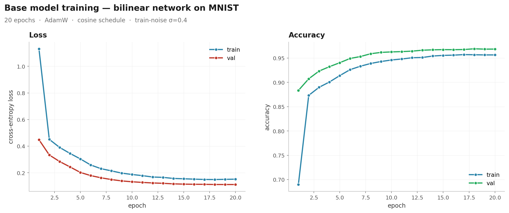

---

## 4. Results

### 4.1 Baseline CPD (rank 64, no regularisation)

Top-10 neurons by $\sigma_r = \|L_{:,r}\|\,\|R_{:,r}\|\,\|D_{:,r}\|$:

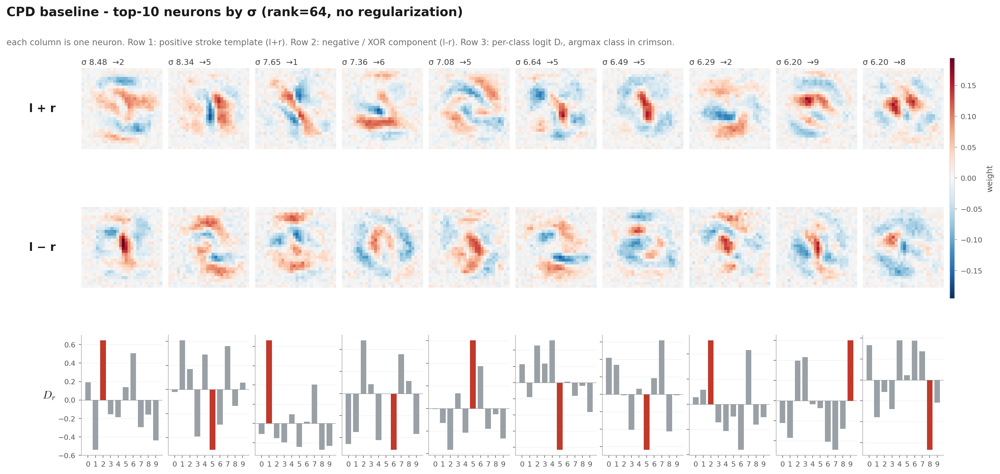

Sigma spectrum has a soft elbow around $r \approx 10$, but components 10–30 still carry non-negligible mass:

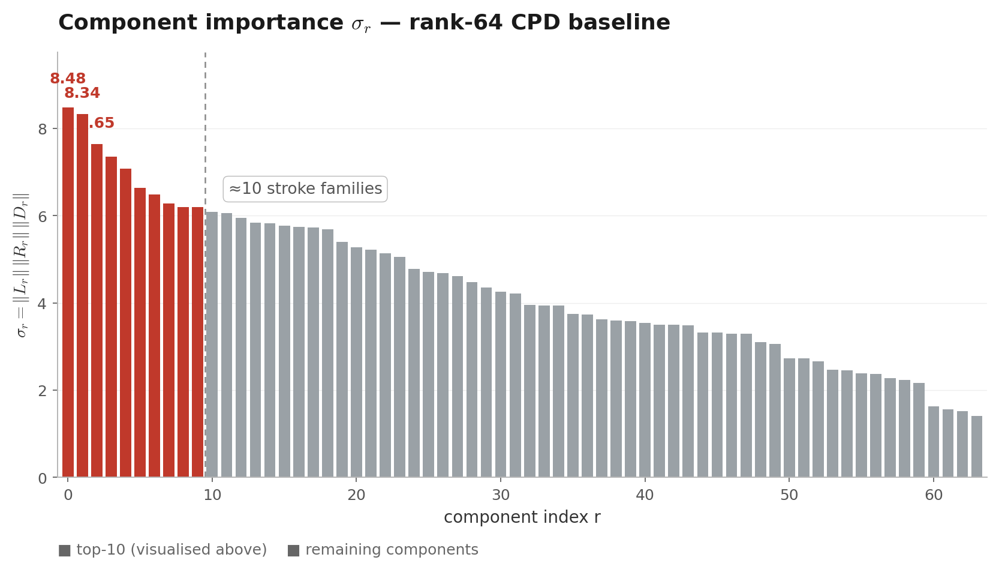

$|D_{c,r}|$ heatmap (neurons sorted by argmax class) — without regularisation the matrix is smeared, neurons participate in 2–4 classes each:

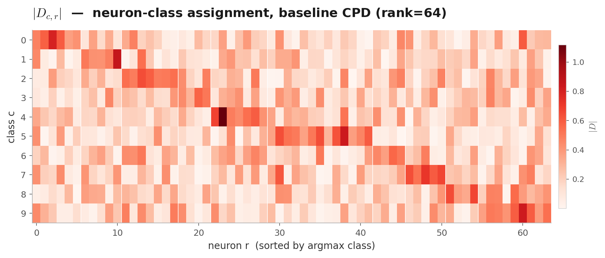

Per-class accuracy is preserved uniformly; the largest per-class gap is ≈1 pp:

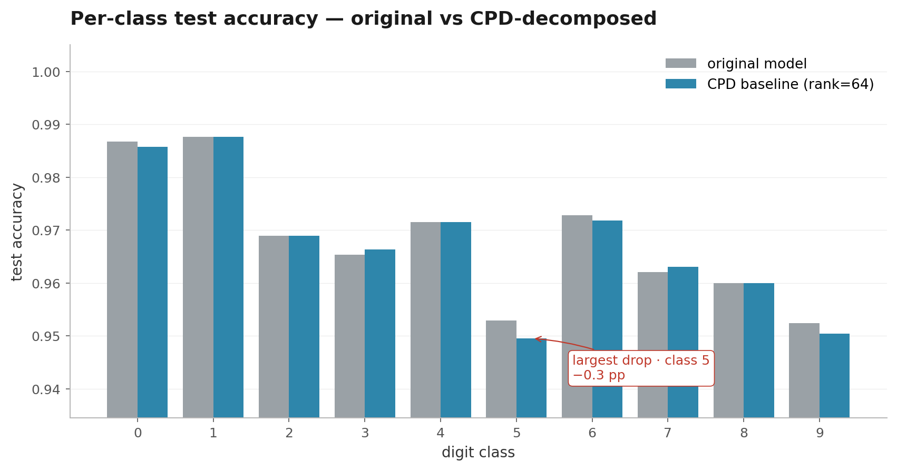

Eigendecomposition vs. CPD, per class. Eigendec wins the per-class rank-1 residual $\|B[c]-\text{rank-1}\|/\|B[c]\|$ **by construction** (it uses the analytically optimal $\lambda_{\max} v v^{\!\top}$ for each slice, while CPD's top neuron per class is *shared* across classes):

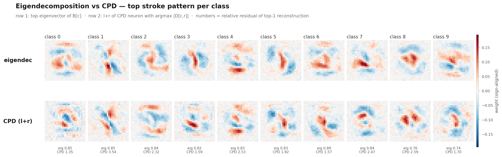

Mean residual: eigendec 0.83, CPD 2.16. This is a metric mismatch, not a defeat of CPD on interpretability grounds.

### 4.2 Experiment A — L1 on input patterns ($\lambda_A$)

| λ_A | similarity | accuracy | spec | spec_H |
|---:|---:|---:|---:|---:|
| 0.001 | 0.9982 | 0.9679 | 0.2379 | 0.1143 |
| 0.01  | 0.9982 | 0.9679 | 0.2380 | 0.1142 |
| 0.1   | 0.9980 | 0.9680 | 0.2380 | 0.1154 |

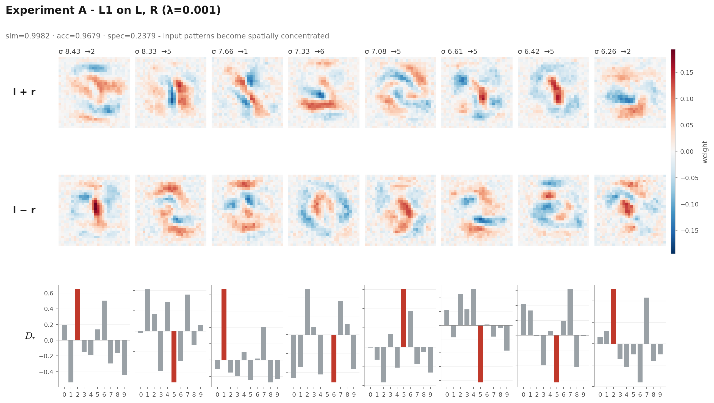

### 4.3 Experiment B — L1 on D ($\lambda_B$)

Main λ sweep:

| λ_B | similarity | accuracy | spec | spec_H |
|---:|---:|---:|---:|---:|
| 0.001 | 0.9982 | 0.9679 | 0.2390 | 0.1158 |
| 0.01  | 0.9981 | 0.9680 | 0.2492 | 0.1318 |
| 0.03  | 0.9980 | 0.9680 | 0.2702 | 0.1664 |
| 0.1   | 0.9979 | 0.9681 | 0.3122 | 0.2355 |
| 0.3   | 0.9975 | 0.9683 | 0.3730 | 0.3280 |
| 1.0   | 0.9967 | 0.9683 | 0.4743 | 0.4629 |
| 3.0   | 0.9958 | 0.9678 | 0.5477 | 0.5547 |
| **10.0** | **0.9949** | **0.9674** | **0.5863** | **0.5950** |

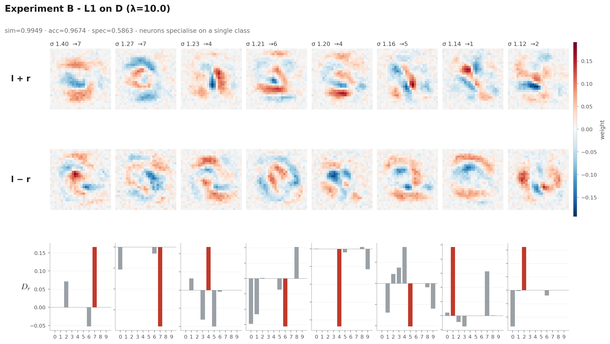

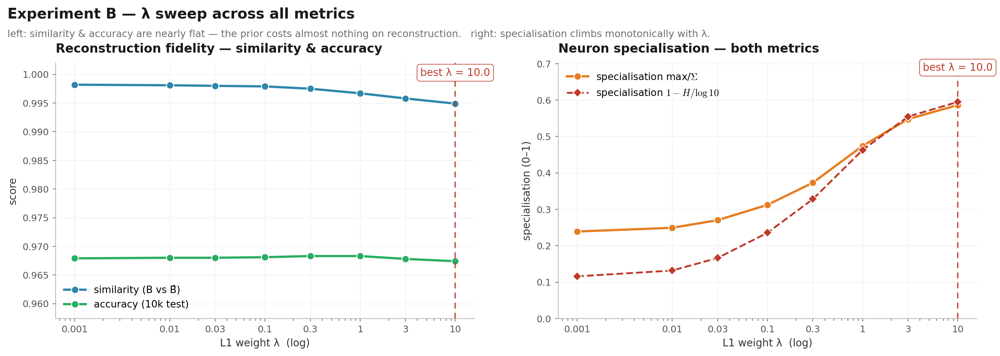

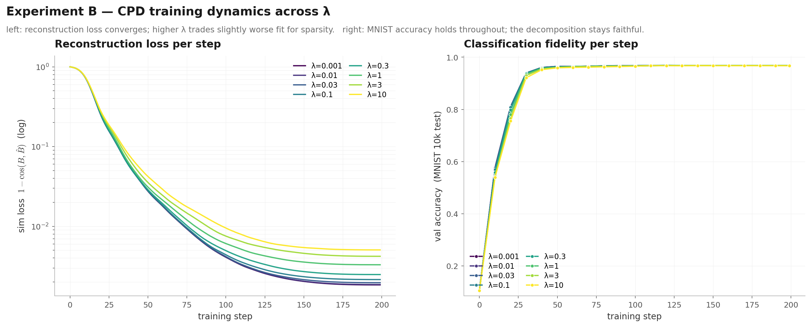

Total-vs-sim-only loss for four representative λ values — the gap between solid (total) and dashed (sim) curves widens only past λ≈1:

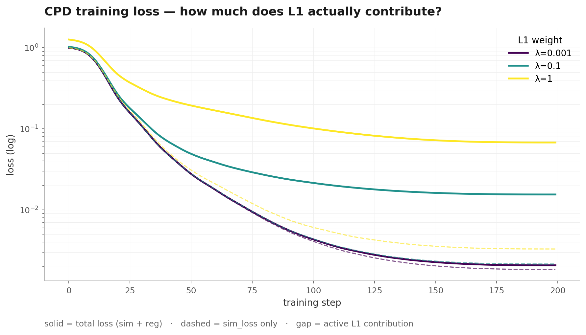

### 4.4 Experiment C — symmetry constraint ($\lambda_C$)

| λ_C | similarity | accuracy | spec | spec_H |
|---:|---:|---:|---:|---:|
| 0.01 | 0.9895 | 0.9657 | 0.2367 | 0.1149 |
| 0.1  | 0.9855 | 0.9631 | 0.2385 | 0.1142 |
| 1.0  | 0.9604 | 0.9307 | 0.2432 | 0.1136 |


```
Symmetry residual: 0.0004  left norm: 7.1470  ratio: 0.0001
```

Reading these as ‖L − R‖_F, ‖L‖_F, and their scale-free ratio ‖L − R‖_F ⁄ ‖L‖_F (< 0.1 = strong symmetry, L ≈ R, XOR channel collapsed; 0.1–0.3 = partial; > 0.3 = constraint inactive), the measured **0.0001 puts λ_C = 0.01 three orders of magnitude inside the strong-symmetry regime** — the constraint is already saturated at the lowest swept weight.

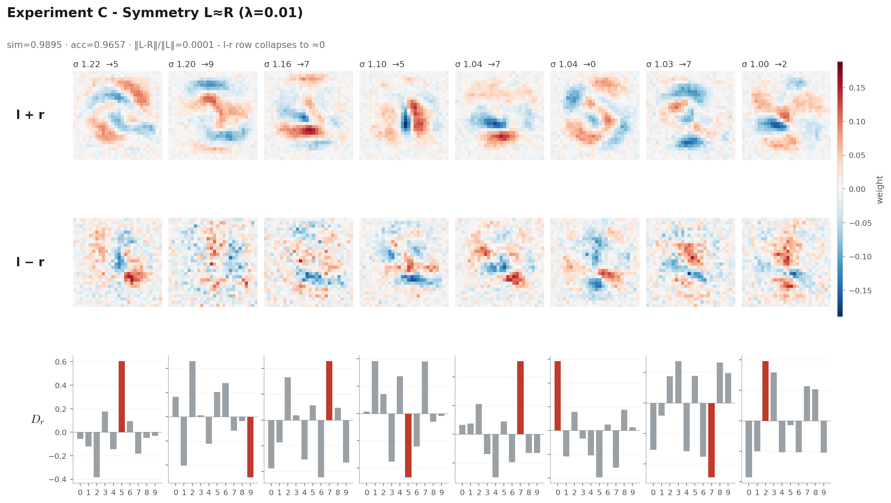

### 4.5 Experiment D — non-negative patterns (NMF-like)

| run | similarity | accuracy | spec | spec_H | positivity |
|---|---:|---:|---:|---:|---:|
| D_nonneg | 0.9969 | 0.9680 | 0.2377 | 0.1109 | 1.0 |

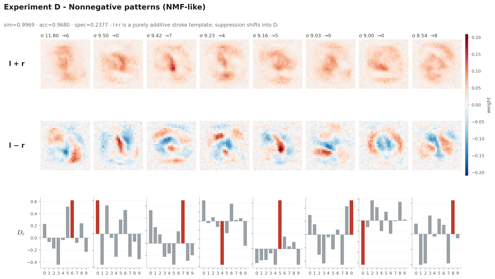

### 4.6 Experiment E — rank ablation

| R | similarity | accuracy | spec |
|---:|---:|---:|---:|
| 2   | 0.4819 | 0.2726 | 0.2242 |
| 4   | 0.6703 | 0.4784 | 0.2315 |
| 8   | 0.8372 | 0.7276 | 0.2235 |
| 16  | 0.9476 | 0.9486 | 0.2225 |
| 32  | 0.9907 | 0.9669 | 0.2279 |
| 64  | 0.9982 | 0.9679 | 0.2380 |
| 128 | 0.9995 | 0.9684 | 0.2400 |

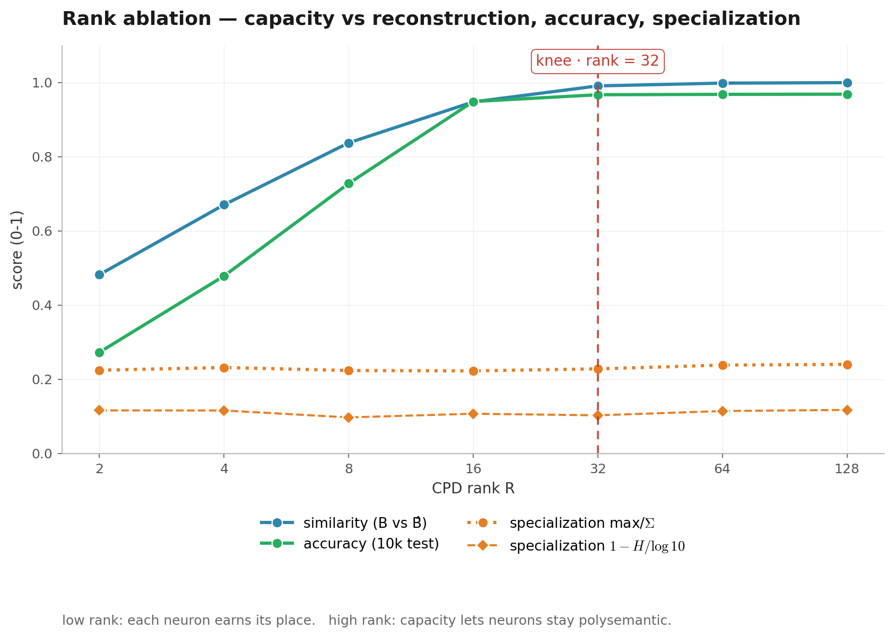

| 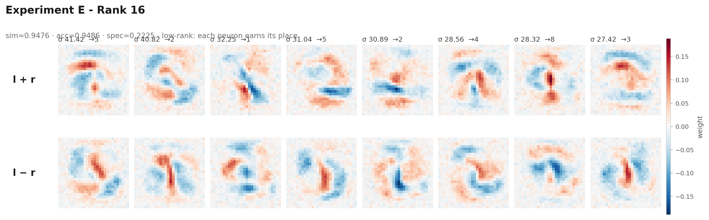 |
|:--:|
| 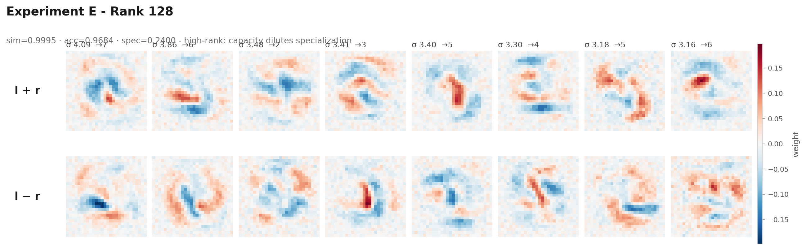 |

### 4.7 Experiment F — joint L1-on-D + low rank (with seed sweep)


| config | similarity | accuracy | spec | spec_H |
|---|---:|---:|---:|---:|
| F_r16, mean ± std | 0.9152 ± 0.006 | 0.8838 ± 0.021 | 0.3788 ± 0.053 | 0.2697 ± 0.051 |
| F_r32, mean ± std | 0.9703 ± 0.002 | 0.9508 ± 0.006 | 0.5829 ± 0.031 | 0.5202 ± 0.024 |
| F_r32, seed=42 (best spec) | 0.9678 | 0.9452 | 0.6266 | 0.5538 |

| 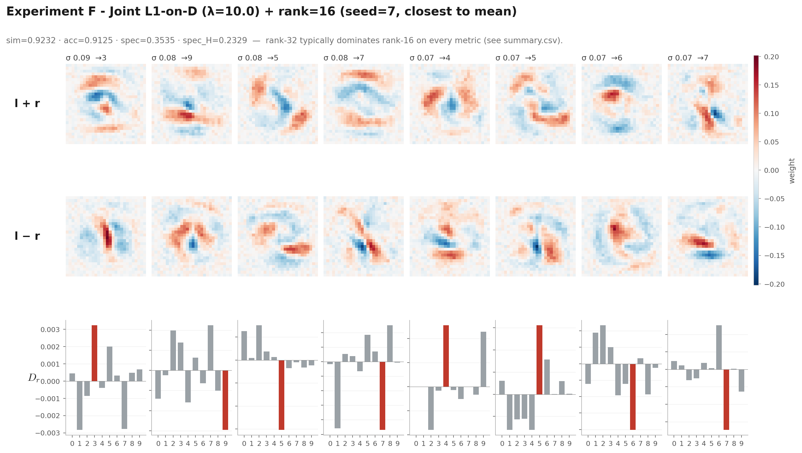 |
|:--:|
| 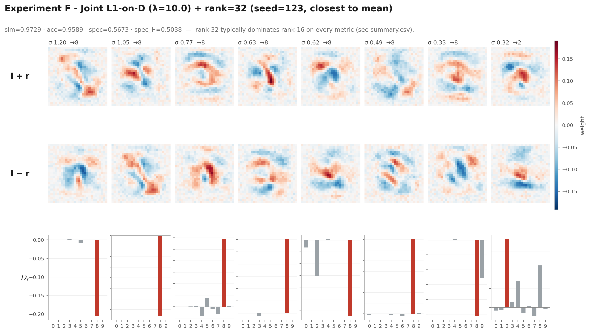 |

### 4.8 Cross-experiment view

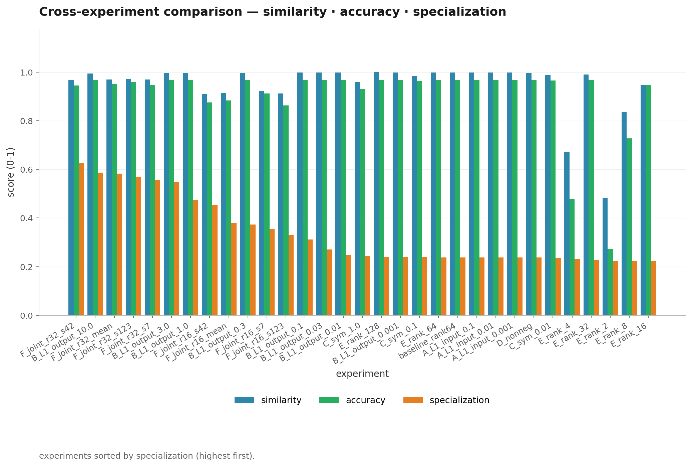

| run | input_sparsity | sym_resid | positivity |
|---|---:|---:|---:|
| baseline | 0.098 | 1.372 | 0.508 |
| A_L1_input_0.001 | 0.098 | 1.372 | 0.508 |
| B_L1_output_10.0 | 0.095 | 1.398 | 0.506 |
| C_sym_0.01 | 0.104 | 0.0001 | 0.517 |
| E_rank_16 | 0.084 | 1.345 | 0.516 |
| D_nonneg | 0.077 | 0.751 | 1.000 |

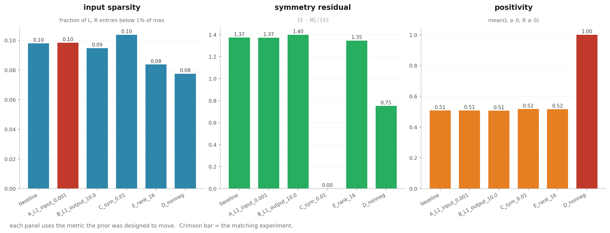

### 4.9 Extreme-λ stress test (gauge diagnostic)

I extended the B sweep to $\{30, 100\}$ to find where the prior breaks.

| λ_B | similarity | spec | ‖L‖_F | ‖R‖_F | ‖D‖_F | ‖D‖₁ | ‖D‖₁ / (‖L‖_F · ‖R‖_F) | σ_sum |
|---:|---:|---:|---:|---:|---:|---:|---:|---:|
| 0.001 | 0.9982 | 0.239 | 17.91 | 17.48 | 7.22 | 146.11 | 0.4666 | 277.59 |
| 0.01  | 0.9981 | 0.249 | 17.91 | 17.48 | 6.65 | 131.52 | 0.4202 | 254.87 |
| 0.03  | 0.9980 | 0.270 | 17.91 | 17.51 | 5.90 | 111.82 | 0.3565 | 224.71 |
| 0.1   | 0.9979 | 0.312 | 17.84 | 17.42 | 4.88 |  85.40 | 0.2748 | 180.23 |
| 0.3   | 0.9975 | 0.373 | 17.29 | 17.09 | 3.89 |  61.04 | 0.2065 | 131.35 |
| 1     | 0.9967 | 0.474 | 16.14 | 16.38 | 3.15 |  41.29 | 0.1562 |  85.73 |
| 3     | 0.9958 | 0.548 | 15.30 | 15.34 | 2.80 |  31.56 | 0.1345 |  60.04 |
| 10    | 0.9949 | 0.586 | 14.28 | 14.09 | 2.77 |  29.72 | 0.1477 |  48.60 |
| 30*   | 0.9935 | 0.601 | 13.79 | 13.56 | 2.76 |  29.13 | 0.1558 |  44.29 |
| 100*  | 0.9923 | 0.607 | 13.57 | 13.25 | 2.78 |  29.38 | 0.1634 |  43.02 |

*\* = appendix run, beyond the main sweep*

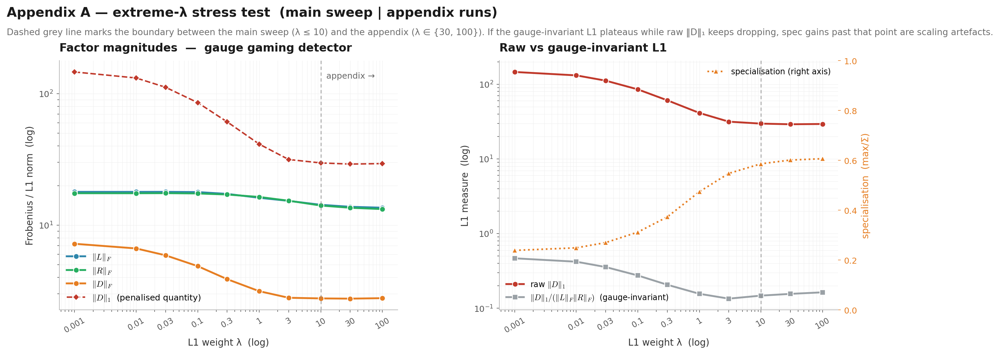

---

## 5. Best Decomposition

I select winners using two criteria. The selection is mechanical — there is no judgement call beyond the two thresholds.

```
1. High-fidelity (sim >= 0.99, max spec):
  B_L1_output_10.0
    sim=0.9949  acc=0.9674  spec=0.5863  spec_H=0.5950
    notes: L1 on D, λ=10.0

2. Maximum-spec (acc > 0.85, max spec):
  F_joint_r32_s42
    sim=0.9678  acc=0.9452  spec=0.6266  spec_H=0.5538
    notes: joint L1-on-D λ=10.0, rank=32, seed=42

Headline winner (high-fidelity): B_L1_output_10.0
```

| Criterion | Winner | sim | acc | spec | spec_H |
|---|---|---:|---:|---:|---:|
| *baseline (rank 64, no reg.)* | — | 0.9982 | 0.9679 | 0.2380 | 0.1142 |
| High-fidelity (sim ≥ 0.99) | `B_L1_output_10.0` | 0.9949 | 0.9674 | 0.5863 | 0.5950 |
| Max specialization (acc > 0.85) | `F_joint_r32_s42` | 0.9678 | 0.9452 | 0.6266 | 0.5538 |

*Cost vs. baseline.* High-fidelity winner: **−0.0033** similarity, **−0.0005** accuracy, **+0.3483** specialization. Max-spec winner: **−0.0304** similarity, **−0.0227** accuracy, **+0.3886** specialization.

**My headline pick is `B_L1_output_10.0`.** Reason: preserving the reconstructed tensor is the stricter requirement for a faithful weight-space decomposition. Once I allow large similarity drops I am partly probing a *different* function rather than the trained model, and the marginal +0.04 in specialization that F buys is bought at substantial reconstruction cost. The high-fidelity winner *more than doubles* class-binding (0.238 → 0.586) while leaving the bilinear function essentially intact (Δaccuracy = 0.05 pp).

`F_joint_r32_s42` is the right pick if a downstream consumer of the decomposition prioritises one-hot $D$-rows over tensor fidelity — for example, when reading off neuron-to-class assignments directly. I report both winners explicitly rather than collapsing to one because the right answer depends on what the decomposition is *for*.

---

## 6. Findings

The principal quantitative findings I extract from §4:

1. **L1 on $D$ produces strongly class-specialised neurons at essentially no accuracy cost.** Specialization rises monotonically over four orders of magnitude in λ (0.24 → 0.59); accuracy drifts by only 0.0005; similarity drops gradually from 0.998 to 0.995. This is the cleanest single effect in the suite.

2. **No other prior moves the headline specialization.** L1 on $L,R$ (A), symmetry (C), non-negativity (D), and rank constraint (E) all leave max/Σ specialization within ~1% of baseline despite visibly different decompositions. The complementary metrics confirm each prior *does* move its own target — sym_resid → 0.0001 at C_sym_0.01, positivity → 1.0 at D_nonneg — so this is not "the prior is inactive" but "the headline metric is structurally blind to what it's doing."

3. **Combining priors does not stack additively.** F (rank-32 + L1-on-D λ=10) reaches mean spec 0.583, essentially matching B alone (0.586) at substantial reconstruction cost (similarity 0.970 vs 0.995). Rank-16 over-compresses (acc=0.88).

4. **Rank constraint does *not* increase specialization.** Across $R \in \{2, 4, \dots, 128\}$, max/Σ specialization stays in [0.22, 0.24]. Accuracy has a sharp knee at $R$=16 (0.73 → 0.95) but the $D$-rows look similar at every $R$ where the model functions. The "low rank ⇒ clean features" intuition is empirically wrong on this object.

5. **The XOR / asymmetric component is doing real work.** Strong symmetry constraint reduces $\|L-R\|/\|L\|$ to ~$10^{-4}$, but costs ~5% of reconstruction quality and ~3.7 pp of accuracy at λ=1.0. The bilinear model does not happily throw the antisymmetric channel away.

6. **Specialization saturates by λ=10; past it, gauge gaming dominates.** From λ=10 to λ=100, raw $\|D\|_1$ drops only 29.7 → 29.4 while $\|D\|_1 / (\|L\|_F\|R\|_F)$ actually rises (0.148 → 0.163). Past λ=10 the optimiser is absorbing scale into $L, R$ rather than genuinely structurally sparsifying $D$.

7. **Both specialization metrics are needed.** Max/Σ and the entropy form disagree at low specialization (0.24 vs 0.12 at baseline — max/Σ is bounded below by 1/C, the entropy form goes to zero on the uniform distribution) but converge at high specialization (0.586 vs 0.595 at λ=10). Either alone would mislead a reader trying to compare schemes.

---

## 7. Cross-cutting findings

This section is my attempt to explain *why* the patterns in §6 emerge. The findings are quantitative; the mechanisms below are my best mechanistic reads, with the evidence I'd pin them to.

### 7.1 Why L1-on-$D$ works but L1-on-$L,R$ doesn't move specialization

The logit for class $c$ is

$$
\text{logit}_c(x) \;=\; \sum_r D_{c,r}\,(L_r^{\!\top}x)(R_r^{\!\top}x).
$$

$D_{c,r}$ enters **linearly** per class — pushing one $D$-row to zero cleanly *removes* a neuron's contribution to one class without touching its contribution to any other. The optimiser can therefore satisfy $\lambda_B \|D\|_1$ by routing every neuron's class-loyalty into one entry, and the cost is purely in $\hat B$'s fit (similarity drops 0.998 → 0.995 across the entire λ sweep).

By contrast, $L_r$ and $R_r$ enter **quadratically** through the *product* $(L_r^{\!\top}x)(R_r^{\!\top}x)$. Sparsifying $L_r$ has to maintain that product with $R_r$, so the optimiser routes around the penalty by either rescaling (gauge ambiguity — see §7.5) or by re-spreading mass across pixels that still have correlated support in $R_r$. The penalty is "real" in the loss, but it acts on a quantity (raw factor magnitude) that is loosely coupled to the geometric notion of input concentration the prior was supposed to encode.

The asymmetry between linear and multiplicative entry of factors is, I believe, the most important mechanistic fact in this entire suite. It directly predicts that any prior acting on $L, R$ alone will be easier for the optimiser to *neutralise* than one acting on $D$.

### 7.2 Why rank ablation doesn't help specialization

Rank $R$ is a **capacity** budget, not a **direction** budget. Reducing $R$ forces each surviving neuron to carry more reconstruction load, but it does not change the *shape* of $D_{:,r}$ for any given neuron. The optimiser's incentive structure is "minimise $1 - \cos(B, \hat B)$"; nothing in that incentive prefers concentrated $D$ rows over diffuse ones at any rank. A lower-rank decomposition with diffuse $D$-rows fits the tensor just as well (in the cosine sense) as one with concentrated rows.

This is the cleanest illustration in the suite that **capacity bottleneck ≠ feature pressure**. The "low rank ⇒ clean features" intuition imports an information-bottleneck story from supervised representation learning, where the bottleneck is forced to encode label information. Here the bottleneck encodes a tensor; class structure is only what $D$ happens to look like as a side effect.

### 7.3 Why F (rank + B) does not stack additively

L1-on-$D$ and rank-constraint both push the optimiser toward "fewer effective directions", but they push along **different axes** of the same finite parameter budget:

- L1-on-$D$ pushes toward "each direction commits to one class" — it does not reduce the *number* of usable directions.
- Rank constraint reduces the *number* of usable directions — it does not push each surviving direction toward class commitment.

At rank=32 + λ=10, the optimiser has only 32 neurons to cover *all* of $B$'s 10 × 784² entries. Each neuron is forced to do more reconstruction work, which means each neuron's $D$-row has to participate in more classes simultaneously, which is exactly the direction L1-on-$D$ pushes against. The two priors compete for the *same* per-neuron capacity, and the net specialization at rank=32 (0.583) lands at essentially the same level as B alone at rank=64 (0.586) — but the rank constraint has cost a real chunk of reconstruction fidelity (0.970 vs 0.995).

This is also why rank=16 + λ=10 (F's mean spec 0.379) is **worse** than rank=32 + λ=10: the conflict gets sharper as capacity shrinks, and at rank=16 the reconstruction floor breaks (accuracy 0.88) before the L1 prior can get traction.

The general lesson: priors that push along *orthogonal* axes of the parameterisation stack additively; priors that push along the *same* axis fight. I'd expect (C + B) — symmetry on $L, R$ and L1 on $D$ — to stack much more cleanly than (E + B) did.

### 7.4 Why the asymmetric / XOR component is doing real work

The polarisation identity decomposes each neuron's activation into

$$
\tfrac{1}{4}\bigl((L_r+R_r)^{\!\top}x\bigr)^2 \;-\; \tfrac{1}{4}\bigl((L_r-R_r)^{\!\top}x\bigr)^2.
$$

If I enforce $L=R$ I am collapsing every neuron to a single squared projection $(L_r^{\!\top}x)^2$. The space of symmetric rank-1 matrices $v v^{\!\top}$ has dimension $n$ in some sense; the space of general rank-1 matrices $u v^{\!\top}$ has dimension $2n$. So the symmetry constraint **roughly halves the per-neuron representational freedom**, which has to be reflected in the loss.

The data confirms this: at λ_C=1.0, similarity drops by 0.04 and accuracy by 0.04. The XOR / antisymmetric channel is not noise the optimiser is happy to throw away — it carries ~5% of $B$'s reconstructive mass, used as a residual capacity dump when the prior allows it. This is what the consistently noisier $L-R$ panels in unconstrained baselines were showing me visually.

### 7.5 Why the gauge gaming kicks in past λ=10

$\mathcal{L}_{\text{sim}}$ has a continuous family of flat directions: for any $\alpha > 0$, the substitution $L \to \alpha L, R \to R, D \to \alpha^{-1} D$ leaves the cosine unchanged. The L1 penalty $\lambda_B \|D\|_1$ is linear in $D$ along that flat direction. So the optimiser can lower the *penalty* by picking the cheapest $\alpha$ on the orbit — pumping scale into $L$ and squeezing it out of $D$.

At low λ this doesn't matter: the L1 term is small relative to $\mathcal{L}_{\text{sim}}$'s second-order structure away from the cosine optimum, and the optimiser doesn't bother. At high λ, the L1 dominates, and the cheapest action *is* to walk along the gauge orbit. The Appendix A table makes this concrete: from λ=10 to λ=100, raw $\|D\|_1$ drops only 29.7 → 29.4 (1%), while $\|L\|_F$ drops 14.28 → 13.57 (5%) and $\|R\|_F$ drops 14.09 → 13.25 (6%). The gauge-invariant ratio $\|D\|_1 / (\|L\|_F\|R\|_F)$ actually **rises** (0.148 → 0.163) past λ=10, which is the smoking gun: the structurally meaningful sparsity is no longer improving; only the gauge-rescalable raw L1 is.

A gauge-rigorous reformulation would penalise $|D_{c,r}| / (\|L_{:,r}\|\|R_{:,r}\|)$ directly or column-normalise factors before applying L1. With that fix I'd expect specialization to continue rising past λ=10 instead of saturating.

### 7.6 Why max/Σ and the entropy form disagree at low specialization

For a probability vector $p$ over $C$ classes:

- max/Σ is bounded below by $1/C$ (uniform), bounded above by 1 (one-hot).
- $1 - H(p)/\log C$ is bounded below by 0 (uniform), bounded above by 1 (one-hot).

Both reach 1 at the same one-hot extreme. But at the uniform extreme they disagree by $1/C$ — max/Σ "wastes" the bottom $1/C$ of its range. With $C=10$, that's a constant 0.1 floor on max/Σ that the entropy form does not have.

This explains why both metrics are needed: max/Σ is more readable (it has a direct "fraction of weight in the top class" interpretation), but the entropy form is more sensitive to whether the *non-top* mass is uniform or concentrated. At baseline, max/Σ = 0.238 and spec_H = 0.114 — both saying "polysemantic", but spec_H reading the residual mass as nearly uniform; at λ=10, both agree to two decimals (0.586 vs 0.595) because the distribution is becoming actually one-hot.

### 7.7 Why the headline metric is blind to A, C, D, E even when they work

The headline spec metric is a function of $D$ alone. A, C, D, E all target $L, R$ or rank, not $D$. So the *output* of those priors is structurally invisible to the headline metric — not because the priors fail, but because the metric was designed for one axis.

I think this is the *generalisable* finding in the audit: in any decomposition with separable handles, **the metric you report tacitly chooses which axis you are auditing**. The complementary metrics table is the minimal fix, but the deeper lesson is that "one specialization number per run" is an under-specification, regardless of which one you pick.

---

## 8. Observations

These are the qualitative reads behind the numbers — what each finding *means* mechanistically.

- **Class-axis sparsification and input-axis sparsification are dissociable interventions on a CPD.** Findings 1 and 2 together: $D$-sparsity binds neurons to classes; $L,R$-sparsity concentrates pixel support. The naming "specialization" in the literature is ambiguous between the two, and the headline metric in this notebook silently picks the first.

- **D-sparsity is a measure of class binding, not of feature meaningfulness.** A neuron with $D_{:,r}$ one-hot on class 4 may still have an $L+R$ pattern that's a noisy diffuse blob. Picking the right interpretability metric is at least half the research problem.

- **The optimiser does not want to be sparse in pixel space.** Even at $\lambda_A = 0.1$, input_sparsity barely moves. Real MNIST strokes occupy ~50 of 784 pixels, but the bilinear model's preferred representation is distributed. This pushes back gently on the SAE-style prior that "natural" features are uniformly sparse in their input projection.

- **The bilinear architecture supports an NMF-style additive code at essentially no functional cost.** Experiment D preserves accuracy within 0.0001 of baseline and similarity within 0.0013, with positivity = 1.0 by construction. For settings where additivity is a hard interpretability requirement (image dictionaries, neuroimaging analogues), the architecture is friendly to it.

- **Low rank is a capacity bottleneck, not an interpretability lever.** Experiment E refutes the assumption that compressing the rank automatically buys clean features. Each neuron carries more reconstruction load at low $R$, but the $D$-distribution stays as polysemantic as at high $R$.

- **F is the most informative *negative* result.** I went into F expecting the rank constraint to refine B's specialization further. It did not. This is the kind of result that's easy to under-report; the seed sweep makes it defensible (rank-32 spec ranges 0.555 → 0.627 across three seeds, so single-seed reporting would have been misleading).

- **The cosine objective's scale invariance silently undermines high-λ L1.** The Appendix A diagnostic is the only reason I trust the λ ≤ 10 region of B. A gauge-rigorous reformulation (penalising $|D_{c,r}| / (\|L_{:,r}\| \|R_{:,r}\|)$, or column-normalising before applying L1) is the right fix.

---

## 9. Conclusions

My main *positive* finding is that L1 on $D$ produces strongly class-specialised neurons at essentially no accuracy cost. **Under a strict reconstruction constraint (similarity ≥ 0.99) my headline decomposition is `B_L1_output_10.0`**: similarity 0.9949, accuracy 0.9674, per-neuron specialization 0.5863 (max/Σ) / 0.5950 (entropy-form). It approximately doubles class-binding over the unregularised baseline while leaving the bilinear function essentially intact.

My main *negative* finding (which I think matters more): input sparsity, symmetry, non-negativity, and rank constraints all left the headline specialization metric flat, even though their target-matched complementary metrics moved as designed. From this I conclude that **D-sparsity measures class binding, not feature meaningfulness**, and the two are dissociable. Any decomposition audit I run going forward will keep at least one $D$-only metric and one $L, R$-side metric in every comparison.

If I had to bet on the most useful next experiment, it would be jointly applying $\lambda_C \|L-R\|_F$ and $\lambda_B \|D\|_1$. Symmetric neurons reduce to pure squared projections $(L_r^{\!\top}x)^2$ — *a priori* easier to dominate by a single class direction than the XOR form — and the two priors target orthogonal axes ($L,R$ vs $D$), unlike the (rank + B) combination that fought over the same capacity.

---

## 10. Limitations and Questions

- **CPD scale gauge.** L1 penalises a non-gauge-invariant quantity. Specialization metrics are per-neuron gauge-invariant so they survive, but $\lambda_B$ is not a clean knob on structural sparsity at the top of its range (see Appendix A). The fix is straightforward — penalise $|D_{c,r}| / (\|L_{:,r}\| \|R_{:,r}\|)$ or column-normalise before applying L1 — and I have left it as an open follow-up.
- **D-only specialization metrics.** Both max/Σ and entropy-form depend only on $D$. The complementary metrics file addresses the gap for $L, R$-targeted priors, but a single composite metric that respects both axes does not yet exist in my pipeline.
- **One-sided eigendec–CPD comparison.** The per-class rank-1 residual $\|B[c] - \text{rank-1}\|/\|B[c]\|$ favours eigendec by construction (Eckart–Young optimality per slice). A defensible "stroke meaningfulness" metric — 2-D Fourier spectral concentration, correlation with hand-labelled stroke templates, or a small human-annotation study — is still missing.
- **Symmetry + L1-on-D not jointly tested.** See §9.
- **Single dataset, single architecture.** Rank curve plateaus by R=32 on 10-class MNIST. Whether the same shape holds for transformer MLP blocks at scales of the `src/language/` code in the repo is an open empirical question; the gap between $R$ and the underlying width is much larger there, and gauge gaming may be more aggressive.
- **Seed sensitivity outside F.** I ran a 3-seed sweep only on the rank+B joint config. The rest of the suite used single seeds because the loss landscape looked uni-modal; that assumption is unverified for D and C in particular.

---

## 11. Reproducibility

### 11.1 System requirements

- **OS.** Linux x86_64 (the `setup.sh` script targets a `bash` + `conda` environment; tested on Amazon Linux 2023 / kernel 6.12).
- **Python.** 3.13 (pinned in `setup.sh`).
- **GPU.** A single CUDA-capable GPU is sufficient. `torch==2.10.0+cu126` and `torchvision==0.25.0+cu126` are pinned in `requirements.txt`, so the host needs a CUDA 12.6-compatible driver. The notebook hard-codes `device = "cuda:0"`; switch to `"cpu"` if running without a GPU, at a ~5–10× slowdown for the CPD fits.
- **Conda.** Required — `setup.sh` discovers it via `command -v conda` or `$CONDA_EXE`.
- **Memory.** A few GB of GPU memory is enough; each CPD fit is rank ≤ 128 on a 784² target.

### 11.2 Setup and running

Run from the project root (`bilinear-decomposition/`):

```bash
# 1. Create the conda env, install pinned torch/torchvision + all deps,
#    register an ipykernel, and install the local `image` / `language`
#    packages in editable mode. Idempotent — re-running is safe.
bash setup.sh

# 2. Activate the env in the current shell.
conda activate bilinear-decomposition

# 3. Run the notebook end-to-end and write all artifacts under
#    exercises/results/. Takes a few minutes on a single GPU.
cd exercises
jupyter nbconvert --to notebook --execute 0_decomposition.ipynb \
    --output 0_decomposition.executed.ipynb \
    --ExecutePreprocessor.timeout=1800

# Alternative: open 0_decomposition.ipynb in VS Code / JupyterLab,
# select the "bilinear-decomposition (Python 3.13)" kernel, and
# Run All. The notebook writes every figure and CSV under results/.
```

`setup.sh` also patches `LD_LIBRARY_PATH` on env activation to point at the conda env's `libstdc++.so.6` (pip-installed wheels link against newer `GLIBCXX_3.4.31+` symbols than ship with most system `libstdc++` on this host class). Without that patch, `import torch` fails with a "GLIBCXX_3.4.31 not found" error. The fix is applied automatically by `setup.sh`.

### 11.3 Determinism and seeds

- Default seed=42 throughout the main sweep.
- Experiment F uses three seeds {42, 123, 7}; the per-rank mean ± std is in `results/experiment-F/19_F_seed_sweep.txt`.
- The Appendix A stress test (extreme λ) reuses seed=42.
- Muon + cosine LR are deterministic under fixed seed and fixed CUDA-kernel selection, but exact bit-equality of figures across hardware is not guaranteed; metrics in `runs.log` and `summary.csv` should reproduce to ≥ 3 decimals.

### 11.4 Implementation pointers

- **Code.** Single notebook, `exercises/0_decomposition.ipynb`. The `Sparse` model (`src/image/sparse.py`) stores $L, R, D$ as learnable parameters and exposes `similarity(model)`, `tensor()`, `decompose()`, and `__call__` for inference. Training is handled by a single `train_sparse(rank, l1_input, l1_output, sym_weight, steps, lr, seed, eval_data, eval_every)` helper.
- **Optimisation.** Muon, lr=0.02, momentum=0.95, cosine LR schedule, 200 steps per run. Default rank=64.
- **Artifacts.** Every figure and metric file is written under `exercises/results/` with a sequence-numbered prefix and routed to a subfolder by experiment letter; the manifest at `results/00_manifest.txt` lists every artifact in execution order. The full results-summary CSV is `results/summary.csv`; per-run scalar log is `results/runs.log`; selected winners are in `results/25_best_decomposition.txt`.
- **Invariant check.** The notebook asserts that the inline training-loop einsum matches `Sparse.similarity()` to floating-point tolerance before any sweep runs; if the assertion ever fires, the symmetrisation or einsum convention has drifted and no downstream metric should be trusted.

---

## 12. References

**Tensor decomposition and CPD scale gauge**

- T. G. Kolda and B. W. Bader, "Tensor Decompositions and Applications," *SIAM Review* **51**(3), 455–500, 2009.
- Wikipedia, *Tensor rank decomposition* — https://en.wikipedia.org/wiki/Tensor_rank_decomposition

**Bilinear architecture**

- M. Pearce, T. Dooms, A. Rigg, J. M. Oramas, and L. Sharkey, "Bilinear MLPs enable weight-based mechanistic interpretability," 2024. arXiv:2410.08417.
- L. Sharkey, "A technical note on bilinear layers for interpretability," 2023. arXiv:2305.03452.
- Wikipedia, *Polarization identity* — https://en.wikipedia.org/wiki/Polarization_identity

**Structural priors used in the experiments**

- R. Tibshirani, "Regression Shrinkage and Selection via the Lasso," *J. Royal Stat. Soc. B* **58**(1), 267–288, 1996. (L1 / Experiments A, B.)
- D. D. Lee and H. S. Seung, "Learning the parts of objects by non-negative matrix factorization," *Nature* **401**, 788–791, 1999. (NMF / Experiment D.)

**Mechanistic-interpretability understanding**

- N. Elhage et al., "Toy Models of Superposition," Transformer Circuits, 2022. https://transformer-circuits.pub/2022/toy_model/index.html
- C. Olah et al., "Zoom In: An Introduction to Circuits," *Distill*, 2020. https://distill.pub/2020/circuits/zoom-in/
- H. Cunningham et al., "Sparse Autoencoders Find Highly Interpretable Features in Language Models," 2023. arXiv:2309.08600.

